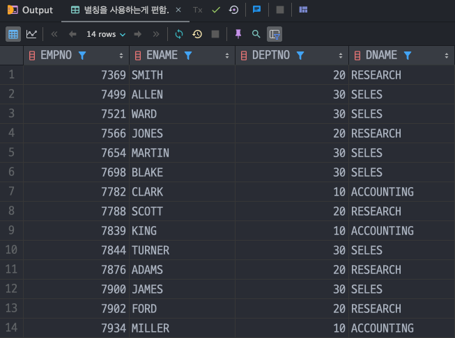
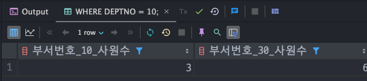

## 4일차 학습

### 목차
> 1. SQL 질의 내부흐름(간단)
> 2. NULL 처리 내장함수
> 3. 조건식 함수
> 4. 다중함수
> 5. Group By
> 6. JOIN(ANSI / Oracle)
> 7. 서브 쿼리
> 8. 문제 풀기
---
### 1. SQL 질의 내부 흐름(간단)
> 사용자가 SQL을 통해 질의를 할 때는 직접적으로 DB와 연결되는게 아닌 `DBMS(DataBase Management System)`을 통해 DB에 연결된다.</br>
> SQL 의 종류로는 `DML(Database Manipulation Language)`, `DDL(Database Definition Language)`, `DCL(Database Control Language)`가 있다.
---
### 2. NULL 처리 내장함수
- NULL 처리 관련함수는 아래와 같다.

  |함수명| 설명                                            |
  |---|-----------------------------------------------|
  |`NVL(col , val)`| col 이 NULL 이면 val으로 대체한다.                     |
  |`NVL2(col1, col2, val)`| col1 이 NULL 이 아니면 col2 로 출력, NULL 이면 0으로 대체   |
---
### 3. 조건식 함수
- 조건식 함수의 종류로는 아래와 같이 있다.

  |함수명| 설명|
  |---|---|
  |`DECODE(col, a,a1,b,b1,..,default)` | col 이 a 조건이면 a1, b조건이면 b1 모든 조건을 비교하면서 결과를 출력 |
  |`CASE()`| DECODE 함수보다 더 좋은 성능의 조건문이다. 아래 예제에서 확인할 수 있다. |

- `DECODE` 예제 : EMP 테이블의 특정 JOB 마다 SAL 값을 변환해서 출력
    ```sql
    SELECT EMPNO,
           ENAME,
           JOB,
           SAL,
           DECODE(JOB, 'MANAGER', SAL * 1.1, 'SALESMAN', SAL * 1.05, 'ALALYST', SAL, SAL * 1.03) AS UP_SAL
    FROM EMP;
    ```
  

- `CASE()` : DECODE 함수보다 더 성능이 좋고 WHEN, THEN, ELSE , END 를 사용하여 조건식을 만든다.
  ```sql
  SELECT EMPNO,
         ENAME,
         JOB,
         SAL,
         CASE JOB
             WHEN 'MANAGER' THEN SAL * 1.1
             WHEN 'SALESMAN' THEN SAL * 1.5
             WHEN 'ALALYST' THEN SAL
             ELSE SAL * 1.03
             END AS UP_SAL
  FROM EMP;
  ```
  
---
### 4. 다중함수
> 다중함수(집계함수) 에는 `SUN()` , `MIN()` , `MAX()` , `COUNT()` , `AVG()` 가 있다.

- `COUNT(col)` : col 컬럼의 갯수를 더해서 출력한다(단, ***NULL 은 제외***하고 더한다)
  ```sql
  SELECT COUNT(COMM)
  FROM EMP;
  ```
  
- `SUM(col)` : col 의 정수형 데이터의 합을 출력
  ```sql
  SELECT SUM(SAL)          AS 중복포함_전체,
         SUM(DISTINCT SAL) AS 중복제거,
         SUM(ALL SAL)      AS 중복포함_전체
  FROM EMP;
  ```
  
- `MAX(col)`, `MIN(col)` : col 컬럼의 정수형 데이터 최소, 최대값을 출력
  ```sql
  SELECT MAX(SAL), MIN(SAL)
  FROM EMP
  WHERE DEPTNO = 10;
  ```
  
- `AVG(col)` : col 컬럼의 평균값을 출력
  ```sql
  SELECT ROUND(AVG(SAL))
  FROM EMP
  WHERE DEPTNO = 30;
  ```
  
- EMP 테이블의 각 부서번호 별로 월급 평균을 구하는 예제이다.
  ```sql
  SELECT '10' 부서명, ROUND(AVG(SAL)) 평균월급
  FROM EMP
  WHERE DEPTNO = 10
  UNION
  SELECT '20' 부서명, ROUND(AVG(SAL)) 평균월급
  FROM EMP
  WHERE DEPTNO = 20
  UNION
  SELECT '20' 부서명, ROUND(AVG(SAL)) 평균월급
  FROM EMP
  WHERE DEPTNO = 30;
  ```
  
- `UNION` 집합연산자를 이용해 테이블을 붙혀서 출력했지만 `GROUP BY`를 사용하면 더 간편하다.
---
### 5. GROUP BY
> 테이블에서 특정 컬럼끼리 그룹으로 묶어 데이터를 집계해야 할 때는 `GROUP BY` 를 쓴다.</br>
> 또 `GROUP BY` 의 조건식이 필요할 때 `HAVING` 을 쓰면된다.

- EMP 테이블에서 `DEPTNO`, `JOB` 컬럼을 그룹화해서 월급의 평균을 구하는 문제이다
  ```sql
  SELECT DEPTNO, JOB, AVG(SAL)
  FROM EMP
  GROUP BY DEPTNO, JOB
  ORDER BY DEPTNO, JOB;
  ```
  
- 집계함수의 조건을 걸때는 `WHRER` 절이 아닌 `HAVING` 절에 적어줘야 한다.
  ```sql
  SELECT DEPTNO, JOB, AVG(SAL)
  FROM EMP
  GROUP BY DEPTNO, JOB
  HAVING AVG(sal) >= 2000
  ORDER BY DEPTNO, JOB;
  ```
  
---
### 6. JOIN
> JOIN 방법은 Oracle 에서 제공하는 방법과 ANSI 표준 방법이 있다.

#### Oracle JOIN 방법
- `동등조인(EQUI-JOIN)` : 두 개의 테이블을 FROM 절에 적어주고 WHERE 절에서 = 연산자를 이용해 연결하는 조인이다.
  ```sql
  SELECT *
  FROM EMP e,
       DEPT d
  WHERE e.DEPTNO = d.DEPTNO;
  ```
  
- `외부조인(OUTER-JOIN)` : 일반적인 조인을 확장한 개념으로, 조인 조건에 만족하는 데이터 뿐만 아니라 어느 한쪽 테이블에 조건이 아닌 컬럼(NULL 포함)이라도 모두 출력하는 조인이다.
  ```sql
  SELECT e.EMPNO, e.ENAME, e.MGR, e2.EMPNO, e2.ENAME, e2.MGR
  FROM EMP e,
       EMP e2
  WHERE e.mgr = e2.empno(+)
  ORDER BY e.EMPNO;
  ```
  

#### ANSI 표준 JOIN 방법
- `ANSI 내부조인(INNER-JOIN)` : FROM 절에서 INNER JOIN 키워들도 두 테이블을 연결, ON 키워드로 조건을 기입한다.
  ```sql
  SELECT e.EMPNO, e.ENAME, d.DEPTNO, d.DNAME, SAL
  FROM EMP e INNER JOIN DEPT d
  ON e.DEPTNO = d.DEPTNO
  WHERE SAL >= 3000
  ORDER BY d.DEPTNO, e.empno;
  ```
  
- `ANSI 외부조인(OUTER-JOIN)` : LEFT-OUTER-JOIN/RIGHT-OUTER-JOIN 으로 나뉜다. 외부조인을 알기전에 Driving Table 과 Driven Table에 대해 이해해야 한다.
  - `Driving Table` : JOIN실행 시 가장 먼저 엑세스 되서 AccessPath를 주도하는 테이블
  - `Driven Table` : JOIN실행 시 나중에 엑세스 되는 테이블
- 보통 PK값이 있는 테이블을 Driving Table로 쓰기 때문에 `LEFT-OUTER-JOIN` 을 많이쓴다.
  ```sql
  SELECT e.EMPNO,
         e.ENAME,
         e.MGR,
         e2.EMPNO AS MEG_EMPNO,
         e2.ENAME AS MGR_ENAME
  FROM EMP e
           LEFT OUTER JOIN EMP e2 ON (e.mgr = e2.empno);
  ```
  
- `FULL OUTER JOIN` : 두 테이블의 모든 열 출력
  ```sql
  SELECT e.EMPNO,
         e.ENAME,
         e.MGR,
         e2.EMPNO AS MEG_EMPNO,
         e2.ENAME AS MGR_ENAME
  FROM EMP e
           FULL OUTER JOIN EMP e2 ON (e.MGR = e2.EMPNO);
  ```
  

---
### 7. 서브쿼리
> `서브쿼리(Sub-Query)`란 SQL 문장 안에서 보조로 사용되는 또 다른 SELECT 문을 의미한다.</br>
> 서브쿼리는 `SELECT` 뿐 아니라 `FROM` , `WHERE` 절 모두에서 사용가능하다.</br>
> > 1. WHERE 절 안에 있는 서브쿼리는 `중첩 서브쿼리(Nested SubQuery)`</br>
> > 2. FROM 절 안에 있는 서브쿼리는 `인라인뷰(Inline View)`</br>
> > 3. SELECT 절 안에 있는 서브쿼리는 `스칼라 서브쿼리(Scalar SubQuery)`</br>

#### 인라인뷰
- FROM 절 안에 들어가는 서브쿼리이다. 예제로 이해하는게 빠르다.
- EMP 테이블에서 급여(SAL)을 내림차순으로 정렬한 다음 상위 5명 정보를 출력한다.
  ```sql
  SELECT *
  FROM (SELECT * FROM EMP ORDER BY SAL DESC)
  WHERE ROWNUM < 6;
  ```
  

#### 중첩 서브쿼리
- WHERE 절 안에 들어가는 서브 쿼리이다.
- EMP 테이블에서 사원명(ENAME)이 'SCOTT' 의 급여(SAL)보다 높은 급여를 받는 행 출력
  ```sql
  SELECT *
  FROM EMP
  WHERE SAL > (SELECT SAL FROM EMP WHERE ENAME = 'SCOTT');
  ```
  
#### 스칼라 서브쿼리
- SELECT 문안으로 들어가는 스칼라 서브쿼리는 반드시 ***단일행 & 단일값***으로 들어가야한다.
---
### 8. 문제
- 문제 1 : EMP 테이블에서 부서 인원이 4명보다 많은 부서의 부서번호, 인원수, 급여의 합
  ```sql
  SELECT DEPTNO, COUNT(DEPTNO) AS 부서인원, SUM(SAL) 총급여
  FROM EMP
  GROUP BY DEPTNO
  HAVING COUNT(DEPTNO) > 4;
  ```
  
- 문제 2 : EMP 테이블에서 가장 많은 사원이 속해있는 부서번호와 사원수를 출력하라
  ```sql
  SELECT DEPTNO, 사원수
  FROM (SELECT DEPTNO, COUNT(EMPNO) AS 사원수
        FROM EMP
        GROUP BY DEPTNO
        ORDER BY 사원수 DESC)
  WHERE ROWNUM <= 1;
  ```
  
- 문제 3 : EMP 테이블에서 가장 많은 사원을 갖는 MGR 의 사원번호를 출력하라
  ```sql
  SELECT MGR
  FROM (SELECT MGR, COUNT(EMPNO) AS 사원수
        FROM EMP
        GROUP BY MGR
        ORDER BY 사원수 DESC)
  WHERE ROWNUM <= 1;
  ```
  
- 문제 4 : EMP 테이블에서 부서번호가 10인 사원수와 부서번호가 30일 사원수를 각각 출력하라
  ```sql
  SELECT COUNT(EMPNO) AS 부서번호_30_사원수
  FROM EMP
  WHERE DEPTNO = 30;
  
  SELECT COUNT(EMPNO) AS 부서번호_10_사원수
  FROM EMP
  WHERE DEPTNO = 10;
  ```
  