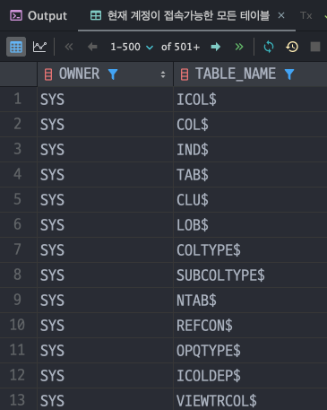

## 5일차 학습

### 목차
> 1. UPDATE , DELETE , DROP 학습
> 2. Transaction 학습
> 3. VIEW 학습
> 4. 데이터 사전 학습
> 5. 시퀀스 학습
> 6. DDL 문 학습
> 7. 제약조건 학습
> 8. 문제
---
### 1. DDL 문 학습
> UPDATE 문은 테이블 컬럼을 수정, DELETE 문은 컬럼을 삭제, DROP 은 테이블자체를 삭제한다.
- `UPDATE` 문의 기본 구조는 아래와 같다.
    ```sql
    UPDATE 테이블명 SET 컬럼명=변경값 
    WHERE 속성명=속성값;
    ```
- 조건절 없이 `UPDATE` 문을 실행하면 전체 컬럼이 수정된다.
  ```sql
  UPDATE DEPT_TMP
  SET LOC='SEOUL'; 
  ```
  
- 보통 `UPDATE` 문을 사용할 때는 조건절을 걸어준다.
  ```sql
  UPDATE DEPT_TMP
  SET LOC='BUSAN'
  WHERE DNAME = 'DATABASE';
  ```
  
- `DELETE` 문에도 조건절이 없으면 전체 삭제된다.
  ```sql
  DELETE
  FROM EMP_TMP
  WHERE JOB = 'SALESMAN';
  ```
  
- `DROP` 은 테이블 자체를 삭제한다.
  ```sql
  DROP TABLE EMP_TMP;
  ```
---
### 2. Transaction 학습
> `Transaction` 은 하나의 일처리 단위이다.
> `Transaction` 안에서 실행하는 작업(데이터조회,수정,삭제,삽입 등)은 안정성을 보장해준다. `Transaction` 내의 작업도중 실패하면 `rollback` 하기 때문에 데이터를 안전하게 해준다.
>> `AUTO COMMIT` 이 켜져있다면 `DCL`,`DDL` 문 실행시 자동으로 `COMMIT` 이된다. 즉, `AUTO COMMIT` 을 꺼두고 학습해야 한다.

- `COMMIT`
  - 보통 데이터 수정하는 SQL을 실행하면 DB에 반영되지 않는다.(메모리 상에서만 반영)
  - ***메모리 상에 반영된 결과를 DB에 반영할려면 COMMIT 명령어를 실행***해야 한다.
  ```sql
  COMMIT [WORK];
  ```
- `ROLLBACK`
  - `ROLLBACK` 은 ***COMMIT 이전으로 되돌리는 명령어***이다.
  ```sql
  ROLLBACK [WORK];
  ```
---
### 3. VIEW 학습
> VIEW 란 하나 이상의 테이블이나 다른 뷰의 데이터를 볼 수 있게 하는 데이터베이스 객체이다.

- `VIEW` 는 **가상의 테이블로 VIEW 에 있는 데이터는 실제 데이터가 아니다.**
- `VIEW` 테이블 구조를 변경해도 원본 테이블에 영향을 끼치지 않는다. -> **독립적인 테이블**
- `VIEW` 생성 명령어
  ```sql
  CREATE OR REPLACE VIEW [스키마.]뷰명 AS
  (SELECT 문장);
  ```
- 여러 개의 테이블에서 필요한 정보를 뽑아 사용할 때가 많은데 이 때 선택할 수 있는 최선책이 VIEW 이다.
- `VIEW` 는 **데이터 보안 측면에서 유리**하다.
- `VIEW` 삭제 명령어
  ```sql
  DROP VIEW [스키마.]뷰명;
  ``` 
---
### 4. 데이터 사전 학습
> 데이터 사전은 Oracle 에서 사요ㅑㅇ하는 시스템 정보부터 사용자, 객체 등에 대한 수많은 내부 정보를 담고 있다.
- 사용가능한 데이터 사전 조회
  ```sql
  SELECT *
  FROM DICT;
  ```
  
- 현재계정이 가지고 있는 테이블 조회
  ```sql
  SELECT TABLE_NAME
  FROM USER_TABLES;
  ```
  
- 현재 계정이 접속가능한 모든 테이블
  ```sql
  SELECT OWNER, TABLE_NAME
  FROM ALL_TABLES;
  ```
  
---
### 5. 시퀀스 학습
> `시퀀스(Sequence)`는 자동 순번을 반환하는 데이터베이스 객체이다.

- 시퀀스를 생성하는 기본명령어는 아래와 같다.
  ```sql
  CREATE SEQUENCE 시퀀스명
  INCREMENT BY 증감숫자
  START WITH 시작숫자
  NOMINVALUE | MINVALUE 최솟값
  NOMAXVALUE | MAXVALUE 최댓값
  NOCYCLE | CYCLE
  NOCACHE | CACHE;
  ```
- 현재 모든 시퀀스를 조회할 수 있다.
  ```sql
  SELECT *
  FROM USER_SEQUENCES;
  ```
  
- 시퀀스 수정은 `ALTER` 문을 사용한다.
  ```sql
  ALTER SEQUENCE  SEQ_DEPT_SEQUENCE INCREMENT BY 3 MAXVALUE 99 CYCLE ;
  ```
- 시퀀스 삭제는 `DROP`문을 사용한다.
  ```sql
  DROP SEQUENCE SEQ_DEPT_SEQUENCE;
  ```
---
### 6. DDL 문 학습
> `DDL(Database Definition Language)` 에는 `CREATE` , `ALTER` , `DROP`, `TRUNCATE` 가 있다.

#### CREATE
- 테이블을 생성하는 명령어다.
  ```sql
  CREATE TABLE EMP_DDL
  (
      EMPNO    NUMBER(4),
      ENAME    VARCHAR2(10),
      JOB      VARCHAR2(9),
      MGR      NUMBER(4),
      HIREDATE DATE,
      SAL      NUMBER(7, 2),
      COMM     NUMBER(7, 2),
      DEPTNO   NUMBER(2)
  );
  ```
- 다른 테이블의 일부를 가져와서 생성할 수 있다.
  ```sql
  CREATE TABLE EMP_DDL1 AS
  SELECT *
  FROM EMP
  WHERE DEPTNO = 30;
  ```
- 원본테이블의 복사하여 빈 컬럼으로 만들 수 있다.
  ```sql
  CREATE TABLE EMP_DDL2 AS
  SELECT *
  FROM EMP
  WHERE 1 <> 1;
  ```
#### ALTER
- 테이블을 수정하는 명령어로 컬럼 추가, 컬럼명 수정, 컬럼 타입 변경, 컬럼 삭제를 할 수 있다.
- 컬럼추가 : `ADD`
  ```sql
  ALTER TABLE EMP_DDL1
      ADD HP VARCHAR2(20);
  ```
- 컬럼명 수정 : `RENAME COLUMN`
  ```sql
  ALTER TABLE EMP_DDL1 RENAME COLUMN HP TO TEL;
  ```
- 컬럼 타입 변경 : `MODIFY`
  ```sql
  ALTER TABLE EMP_DDL1
      MODIFY EMPNO NUMBER(10);
  ```
- 컬럼 삭제 : `DROP COLUMN`
  ```sql
  ALTER TABLE EMP_DDL1
      DROP COLUMN TEL;
  ```
#### TRUNCATE
- `TRUNCATE` 는 테이블에 있는 컬럼을 삭제하는 `DELETE` 와 같지만. 테이블을 초기상태로 만드는 명령어다.
  ```sql
  TRUNCATE TABLE EMP_DDL1;
  ```
#### DROP
- ***테이블을 삭제하는 명령***어다(실무에서 조심)
  ```sql
  DROP TABLE EMP_DDL1;
  DROP TABLE EMP_DDL2;
  DROP TABLE EMP_DDL;
  ```
---
### 7. 제약조건
> 제약조건에는 `NOT NULL` , `PRIMARY KEY` , `UNIQUE` , 'FOREIGN KEY' , 'CHECK' 가 있다.

- `NOT NULL` : 해당 **컬럼에 빈값(NULL)을 허용하지 않는 제약조건**이다.
- `NOT NULL` 제약조건을 걸지 않은 컬럼에 `NOT NULL` 제약조건을 추가한다면, _해당 컬럼에 NULL 이 없어야 한다 !_
  ```sql
  CREATE TABLE TBL_EX
  (
      LOGIN_ID VARCHAR2(20) NOT NULL, -- NOT NULL 제약조건 추가
      LOGIN_PW VARCHAR2(20) NOT NULL, -- NOT NULL 제약조건 추가
      TEL      VARCHAR2(20)
  );
  
  INSERT INTO TBL_EX(LOGIN_ID, LOGIN_PW)
  VALUES ('ADMIN2', '567');
  
  ALTER TABLE TBL_EX
      MODIFY TEL NOT NULL; -- 제약조건 위배로 에러!
  ```
- `UNIQUE` : `UNIQUE` 제약조건은 해당 _**컬럼값이 유일해야 하는 제약조건이다.(중복허용을 하지 않는다)**_
  ```sql
  CREATE TABLE TBL_UNIQ
  (
      LOGIN_ID VARCHAR(20) UNIQUE,
      LOGIN_PW VARCHAR(20) NOT NULL,
      TEL      VARCHAR(20)
  );
  ```
- `FOREIGN KEY` : **외부의 테이블의 PK 또는 UNIQUE 컬럼**을 지정해서 외부테이블과 연동이 가능하다.
- 주의사항으로는 _**부모테이블(외부테이블) 컬럼 값중 없는 값을 자식테이블에 추가할 수 없다.**_
- 외래키 제약조건에는 2가지의 조건을 추가할 수 있다.
  - `ON DELETE CASCADE` : 부모테이블의 값을 삭제하면 자식테이블의 값도 연동해서 삭제
  - `ON DELETE SET NULL` : 부모테이블의 값을 삭제하면 자식 테이블 값이 NULL 로 바뀐다.
  ```sql
  CREATE TABLE TBL_FK(
      LOGIN_ID VARCHAR2(20),
      CONSTRAINT FK FOREIGN KEY (LOGIN_ID)
      REFERENCES TBL_FK (LOGIN_ID)
      [ON DELETE CASCADE | SET NULL]
  );
  ```
- `CHECK` : 컬럼에 입력되는 데이터를 체크해 특정 조건에 맞는 데이터만 입력받고 그렇지 않으면 오류를 뱉어 낸다.
  ```sql
  CREATE TABLE TBL_CHK(
      LOGIN_ID VARCHAR2(20) CONSTRAINT TBLCK_LOGINID_PK PRIMARY KEY , -- PK 제약조건
      LOGIN_PW VARCHAR2(20) CONSTRAINT TBLCK_LOGINPW_CK CHECK(LENGTH(LOGIN_PW) > 3), -- LOGIN_PW 컬럼의 크기를 체크
      TEL VARCHAR(20)
  );
  ```
---
### 8. 문제
- 1번 : EMP 테이블에서 사원번호가 751인 사원의 직업과 같고, 사원번호가 7934인 사원의 급여보다 많은 사원의 사번, 이름 , 직업, 급여를 출력<br>
  ```sql
  SELECT EMPNO, ENAME, JOB, SAL
  FROM EMP
  WHERE JOB = (SELECT JOB FROM EMP WHERE EMPNO = 7521)
    AND SAL > (SELECT SAL FROM EMP WHERE EMPNO = 7934);
  ```
  
- 2번 : 직업별로 최소 급여를 받는 사원의 정보를 사원번호, 이름, 업무, 부서명으로 출력하시오(직업별 내림차순)
  ```sql
  SELECT e.EMPNO, e.ENAME, e.JOB, d.DNAME
  FROM EMP e
           INNER JOIN DEPT d ON e.deptno = d.DEPTNO
  WHERE (e.JOB, e.SAL) IN (SELECT JOB, MIN(SAL)
                           FROM EMP
                           GROUP BY JOB)
  ORDER BY JOB DESC;
  ```
  
- 3번 : 각 사원별 커미션(COMM)이 0 또는 NULL 이고 부서 위치가 'GO'로 끝나는 사원의 정보를 사원번호, 사원이름, 커미션, 부서번호, 부서명, 부서위치를 출력하시오(보너스가 NULL 이면 0으로 출력)
  ```sql
  SELECT e.EMPNO, e.ENAME, DECODE(e.COMM, NULL, 0, e.COMM) AS COMM, e.DEPTNO, d.DNAME, d.LOC
  FROM EMP e
           INNER JOIN DEPT d ON e.DEPTNO = d.DEPTNO
  WHERE d.LOC LIKE '%GO';
  ```
  