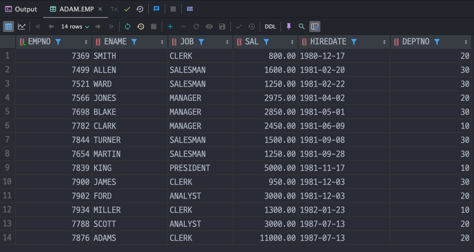

## 6일차 학습

### 목차
> 1. 문제풀기
---
### 1. 문제 풀기
- 문제 1 : EMP 테이블에서 입사일 순으로 사원번호, 이름, 업무, 급여, 입사일자, 부서번호 조회
    ```sql
    SELECT EMPNO, ENAME, JOB, SAL, HIREDATE, DEPTNO
    FROM EMP
    ORDER BY HIREDATE;
    ```
  
- 문제 2 : EMP 테이블에서 부서번호로 정렬한 후 급여가 많은 순으로 사원번호, 성명, 업무, 부서번호, 급여를 조회
  ```sql
  SELECT EMPNO, ENAME, JOB, DEPTNO, SAL
  FROM EMP
  ORDER BY DEPTNO, SAL DESC;
  ```
  
- 문제 3 : EMP 테이블에서 모든 'SALESMAN'의 급여 평균, 최고액, 최저액, 합계를 조회하시오
  ```sql
  SELECT AVG(SAL) 급여_평균, MAX(SAL) 최고액, MIN(SAL) 최저액, SUM(SAL) 합계
  FROM EMP
  WHERE JOB = 'SALESMAN';
  ```
  
- 문제 4 : EMP 테이블에서 각 부서별로 인원수, 급여의 평균, 최저 급여, 최고 급여, 급여의 합을 구하여 급여의 합이 많은 순으로 출력하여라.
  ```sql
  SELECT DEPTNO ,COUNT(EMPNO) 인원수, ROUND(AVG(SAL)) 급여_평균, MIN(SAL) 최저_급여, MAX(SAL) 최고_급여, SUM(SAL) 급여의_합
  FROM EMP
  GROUP BY DEPTNO
  ORDER BY 급여의_합 DESC;
  ```
  